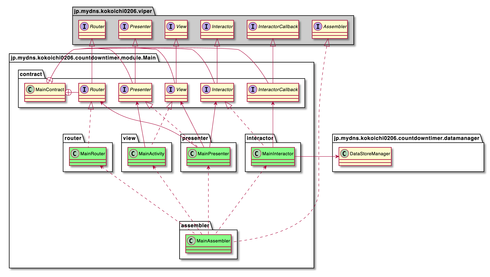
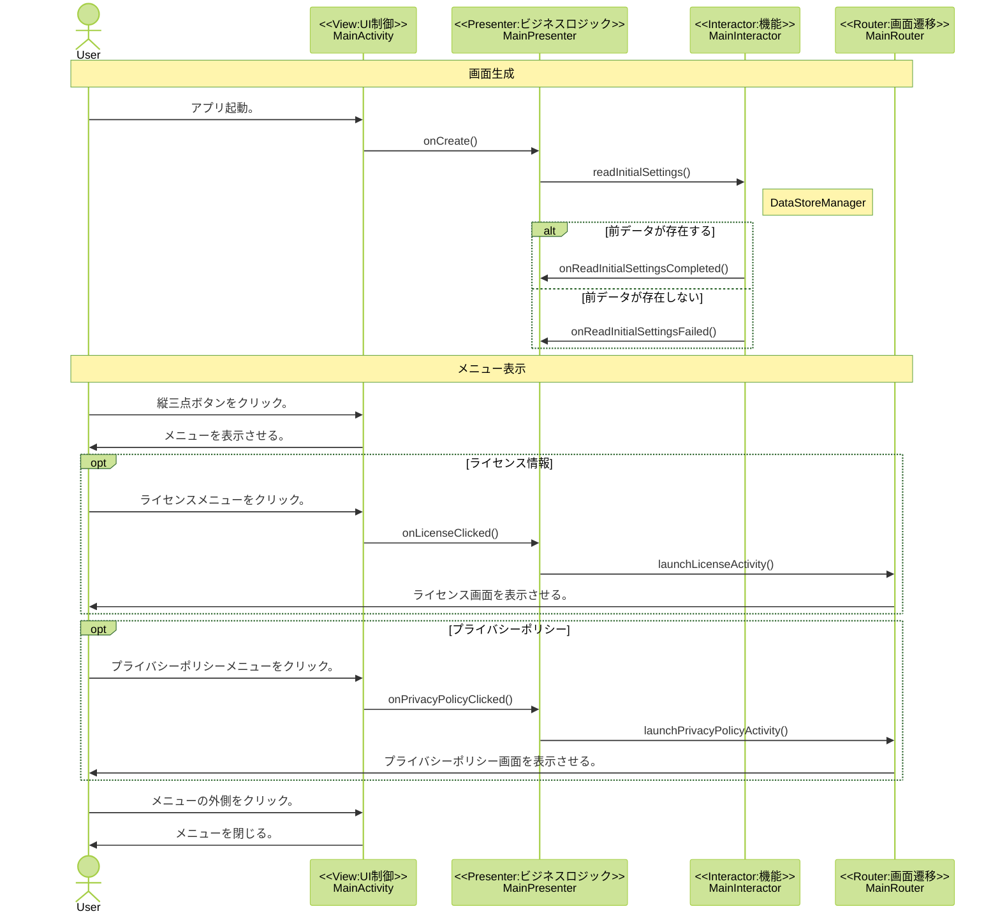

# メイン画面

## 概要
メイン画面の関連クラス

## クラス一覧
- [MainContract](https://github.com/kokoichi206/count-down-timer/tree/main/app/src/main/java/jp/mydns/kokoichi0206/countdowntimer/module/main/contract/MainContract.kt)
    - コンポーネント間で共有される定数、Interfaceを定義するContractクラス。
- [MainActivity](https://github.com/kokoichi206/count-down-timer/tree/main/app/src/main/java/jp/mydns/kokoichi0206/countdowntimer/module/main/view/MainActivity.kt)
    - UI制御を担うVIewクラス。
    - [HomeViwe](https://github.com/kokoichi206/count-down-timer/tree/main/app/src/main/java/jp/mydns/kokoichi0206/countdowntimer/module/main/view/HomeView.kt)
        - メイン画面を表示する。
- [MainInteractor](https://github.com/kokoichi206/count-down-timer/tree/main/app/src/main/java/jp/mydns/kokoichi0206/countdowntimer/module/main/interactor/MainInteractor.kt)
    - 機能を担うInteractorクラス。
    - [DataStoreManager](https://github.com/kokoichi206/count-down-timer/tree/main/app/src/main/java/jp/mydns/kokoichi0206/countdowntimer/datamanager/DataStoreManager.kt)
        - タイマーの情報を読み書きする。
            - タイトル
            - 開始時間
            - 終了予定時刻
- [MainRouter](https://github.com/kokoichi206/count-down-timer/tree/main/app/src/main/java/jp/mydns/kokoichi0206/countdowntimer/module/main/router/MainRouter.kt)
    - 画面遷移を担うRouterクラス。
    - ライセンス情報画面へ遷移する。
    - ユーザーデータ画面へ遷移する。
- [MainPresenter](https://github.com/kokoichi206/count-down-timer/tree/main/app/src/main/java/jp/mydns/kokoichi0206/countdowntimer/module/main/presenter/MainPresenter.kt)
    - ビジネスロジックを担うPresenterクラス。
- [MainAssembler](https://github.com/kokoichi206/count-down-timer/tree/main/app/src/main/java/jp/mydns/kokoichi0206/countdowntimer/module/main/assembler/MainAssembler.kt)
    - モジュールの組み立てを担うAssemblerクラス。

## クラス図

## シーケンス図

